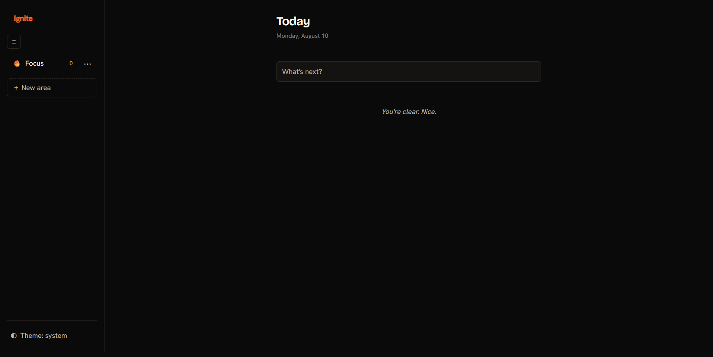

# Ignite

*a small flame, kept going.*

An ADHD-friendly task app — open source, local-first, zero bloat.

**Status:** v0.2.0 — 143 tests passing. **Live:** [malinfossum.github.io/ignite](https://malinfossum.github.io/ignite/)



---

## About the name

*Ignite* — to set something alight; to spark.
In Norwegian: **tenne** (to light, to spark). The tagline reads *"en liten flamme, holdt i live"* — a small flame, kept going.

The name is about starting — and staying with it. Consistency is how anything actually grows: in skills, in habits, in life. For an ADHD brain, the spark is easy — keeping the flame alive is the work. Start small, stay consistent, get where you want to go.

---

## Why

Built to replace a cluttered subscription task app with something minimal, free, and genuinely helpful for ADHD users. Every feature has to earn its place.

- Two levels of hierarchy: **Area → Section → Task**
- Local-first — your data stays on your device (IndexedDB)
- Dark-mode-first, no account required, no paywall

---

## Features

- **Quick capture** — type and go; new tasks land in your **Focus** area
- **Today view** — what's next, with relative time labels that tick live
- **Areas & sections** — organize with a two-level hierarchy; create, rename, reorder, and delete
- **Tasks** — complete, star, reorder, rename in place, and move between sections
- **Undo everything** — deletes (including a whole area and its contents) are undoable from the toast
- **Keyboard & screen reader** — ARIA menu navigation and full keyboard paths throughout
- **Install & offline** — installable PWA; works fully offline once loaded, including airplane mode
- **Mobile** — responsive shell with an off-canvas navigation drawer and a pinned capture bar

---

## Tech

Vanilla HTML, CSS, and JavaScript — no frameworks. Strict MVC with a `subscribe/notify` pattern.

- **Build:** Vite
- **Persistence:** IndexedDB (hand-rolled wrapper)
- **Offline:** hand-rolled service worker + web app manifest
- **Test:** Vitest + fake-indexeddb (143 tests)
- **Format / lint:** Biome
- **Deploy:** GitHub Pages via GitHub Actions

---

## Run locally

```bash
npm install
npm run dev        # start the dev server
npm run test:run   # run the tests once (use `npm test` for watch mode)
npm run build      # production build
npm run check      # Biome lint + format check
```

---

## Install

Open the [live app](https://malinfossum.github.io/ignite/) and add it to your device:

- **Android (Chrome):** menu (⋮) → **Add to Home screen**
- **Desktop (Chrome / Edge):** the install icon in the address bar
- **iOS (Safari):** Share → **Add to Home Screen**

Once installed it runs offline, and your data stays on the device.

---

## Roadmap

Planned, not yet shipped:

- Reminders and scheduled notifications
- Recurring tasks — the recurrence engine exists; the UI is pending
- Drag-to-reorder, due dates, and richer task metadata
- A custom install prompt and a refreshed visual design

Design specs and implementation plans live in `docs/superpowers/`.

---

## License

Licensed under the Apache License, Version 2.0. See [LICENSE](LICENSE) for the full text.

Copyright 2026 Malin Fossum
